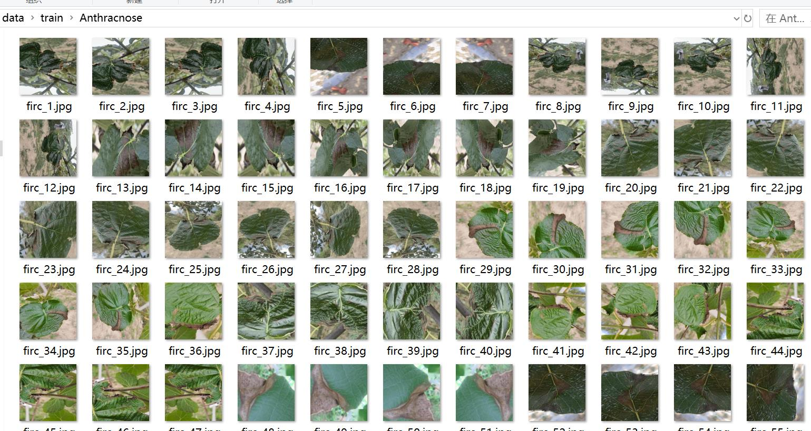
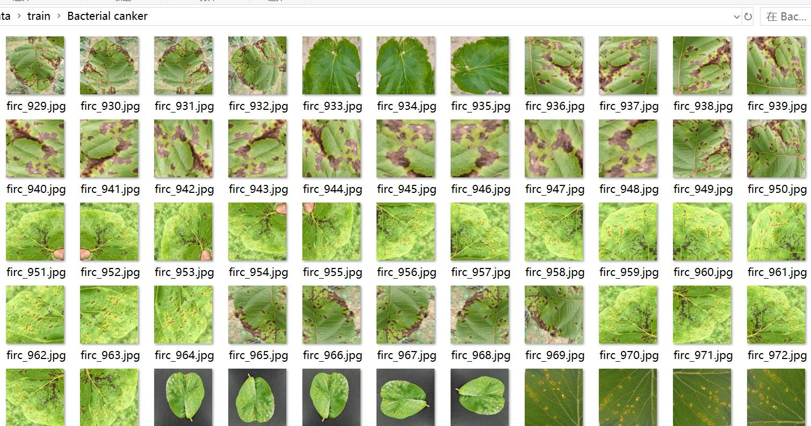
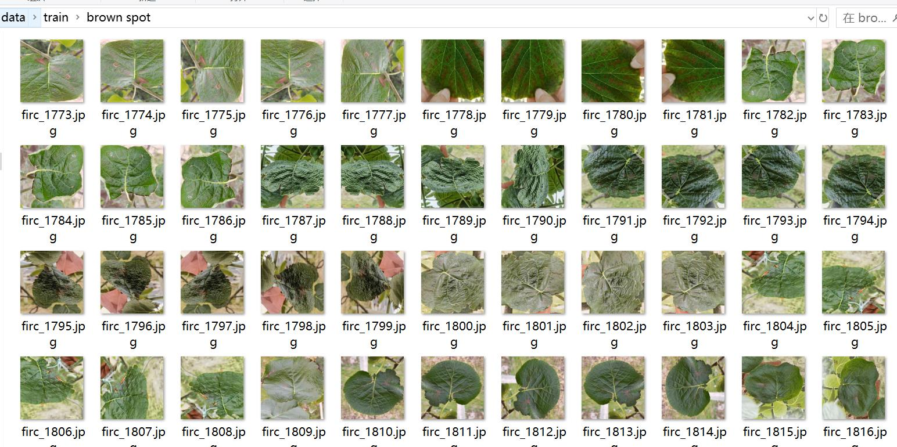
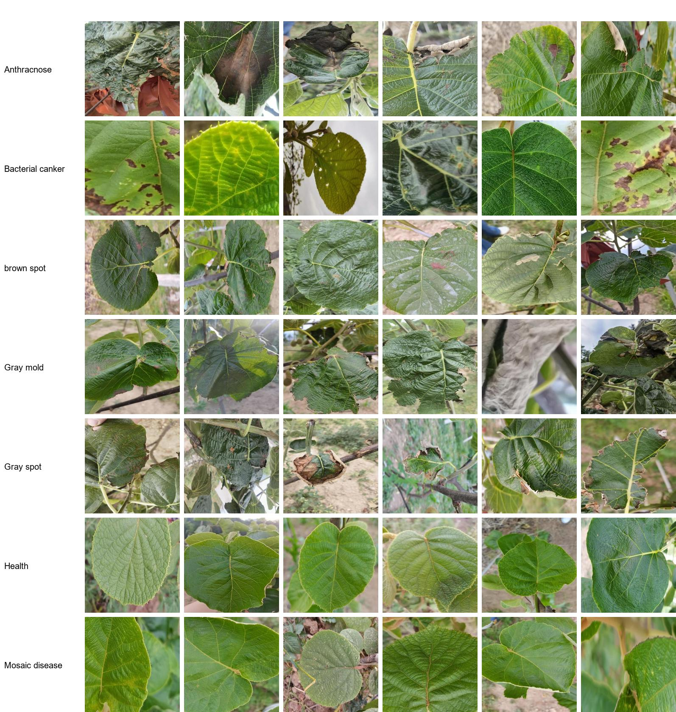

# 9639 Images of Pomelo Leaves with Diseases Classified into 7 Categories

Dataset Type: For image classification use only, not suitable for object detection without labeled files.
Dataset Format: Only contains JPG images, each category folder stores the corresponding images.
Number of Images (JPG Files Count): 9639
Number of Categories: 7
Category Names: ['Anthracnose', 'Bacterial canker', 'Gray mold', 'Gray spot', 'Health', 'Mosaic disease', 'brown spot']
Image Count per Category:
- Training Set Image Count: 6750
- - Anthracnose Training Set Image Count: 928
- - Bacterial canker Training Set Image Count: 844
- - brown spot Training Set Image Count: 1617
- - Gray mold Training Set Image Count: 814
- - Gray spot Training Set Image Count: 831
- - Health Training Set Image Count: 902
- - Mosaic disease Training Set Image Count: 814
Validation Set Image Count: 2889
- - Anthracnose Validation Set Image Count: 397
- - Bacterial canker Validation Set Image Count: 361
- - brown spot Validation Set Image Count: 693
- - Gray mold Validation Set Image Count: 348
- - Gray spot Validation Set Image Count: 355
- - Health Validation Set Image Count: 386
- - Mosaic disease Validation Set Image Count: 349
Test Set Image Count: 0
Total Images Count:
- - Anthracnose Total Images Count: 1325
- - Bacterial canker Total Images Count: 1205
- - brown spot Total Images Count: 2310
- - Gray mold Total Images Count: 1162
- - Gray spot Total Images Count: 1186
- - Health Total Images Count: 1288
- - Mosaic disease Total Images Count: 1163
Important Notes: No specific notes are provided at this time.
Special Declaration: This dataset does not guarantee the accuracy of the trained models or weight files.
Image Preview:

## Images

Here is a pay link on Stripe ( https://buy.stripe.com/3cs8yP7sY87d0vu9AB ). Please contact me lonlonago@foxmail.com after funding $89, and I will send you a complete data files , thank you!

